# FastAPI GIS
***
FastAPI GIS — это серверное API для хранения и обработки геопространственных данных с использованием FastAPI, PostgreSQL и расширения PostGIS. Проект интегрируется с QGIS через специализированный плагин.
##### Это удобное решение для:
- хранения(Postgres)
- обработки(FastApi) 
- визуализации геопространственных данных(QGIS + плагин-расширение).
### Назначение проекта:
- Хранение данных в PostgreSQL + PostGIS.
- Обработка и доступ к данным через FastAPI.
- Дашбоард на главной странице со статистикой
- Визуализация и работа с данными в QGIS посредством плагина.

### Соответствие стандартам
- Проект написан в соответствии со стандартом PEP 8
- Код проверен статическим анализатором Ruff
- Используется Pyright для типизации и проверки аннотаций
- Все эндпоинты покрыты интеграционными тестами.
- 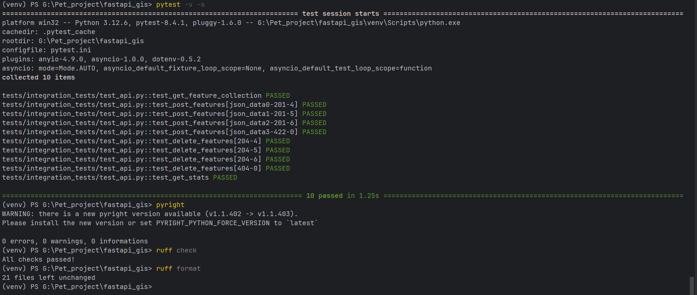

***
# Возможности
- Работа с точками, линиями и полигонами через REST API.
- Пространственные запросы с поддержкой PostGIS.
- Интерактивная документация API (Swagger UI и ReDoc).
- Интеграция с QGIS 3.40+ через плагин на PyQGIS API.
***

# Требования
- Python 3.12+
- PostgreSQL 15+ с расширением PostGIS
- Docker(опционально для быстрого запуска)
***
# Установка

## 1. Клонирование репозитория
    git clone https://github.com/DrHy6yC/fastapi_gis.git
    cd fastapi_gis

## 2. Виртуальное окружение и зависимости
    python -m venv venv
    source venv/bin/activate  # Linux/MacOS
    venv\Scripts\activate     # Windows
    pip install -r requirements.txt
## 3. Настройка базы данных
Убедитесь, что установлен PostgreSQL с расширением PostGIS. Создайте базу данных:
``````
CREATE DATABASE gis_db;
\c gis_db
CREATE EXTENSION postgis;
``````
## 4. Переменные окружения
- Создайте файл .env в корне проекта и заполните его по примеру .env.example:

## 5. Запуск приложения
    python -m uvicorn src.main:app
- Приложение будет доступно по адресу: http://localhost:8000


# Запуск через Docker
## Если хотите развернуть проект в Docker:
- Настроить переменные окружения
``````
docker-compose up -d
``````
- Приложение будет доступно по адресу: http://localhost:8000, а PostgreSQL — на порту 5432.

## Тестирование
- Для написания и запуска тестов используется pytest с поддержкой pytest-asyncio и  pytest-dotenv.

- Конфигурация для тестирования задаётся через отдельный .test.env. 
- Запуск тестов:
`````
pytest
`````
***
## Документация API
### После запуска сервера доступны:
- Главная с дашбоардом: http://127.0.0.1:8000/
- Swagger UI: http://localhost:8000/docs
- ReDoc: http://localhost:8000/redoc
## Главная/Дашбоард
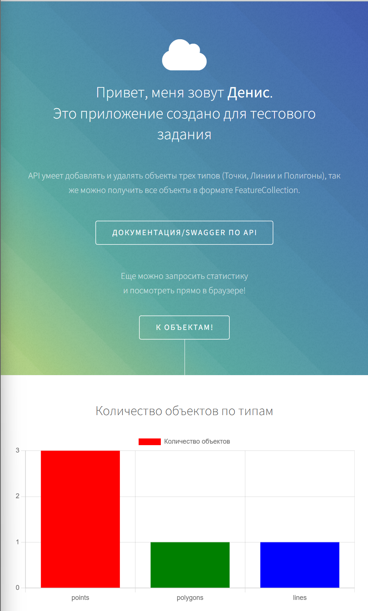
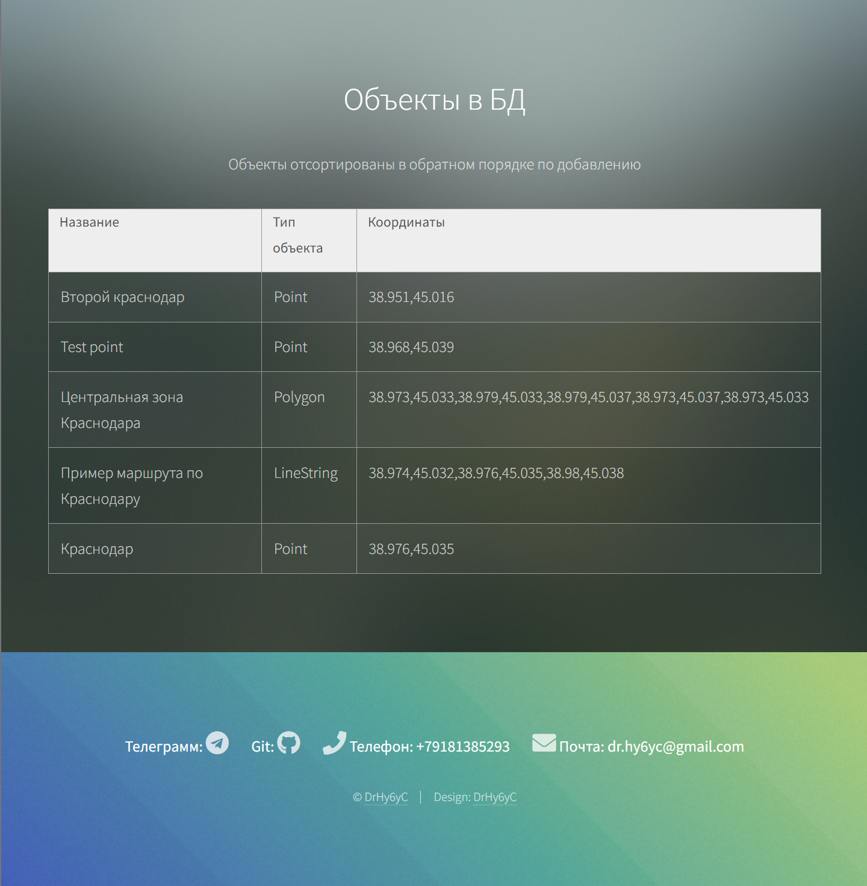

## Примеры запросов
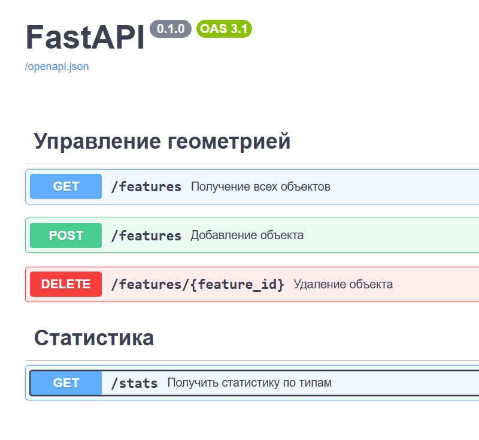
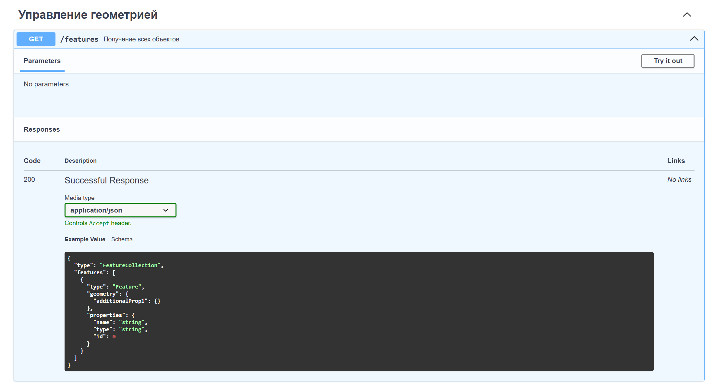
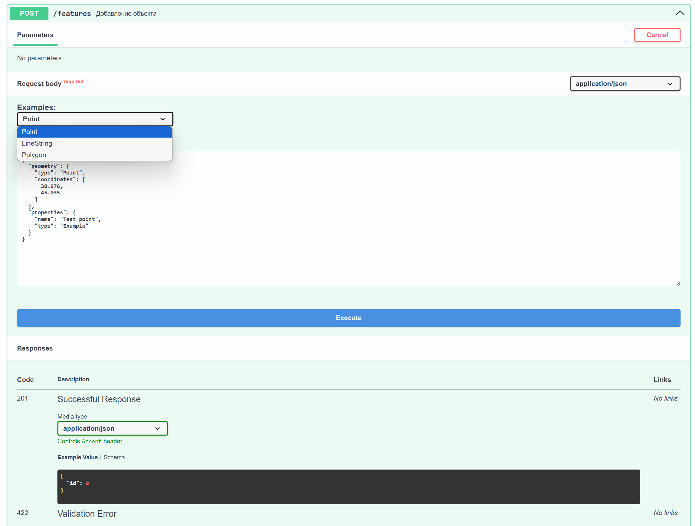
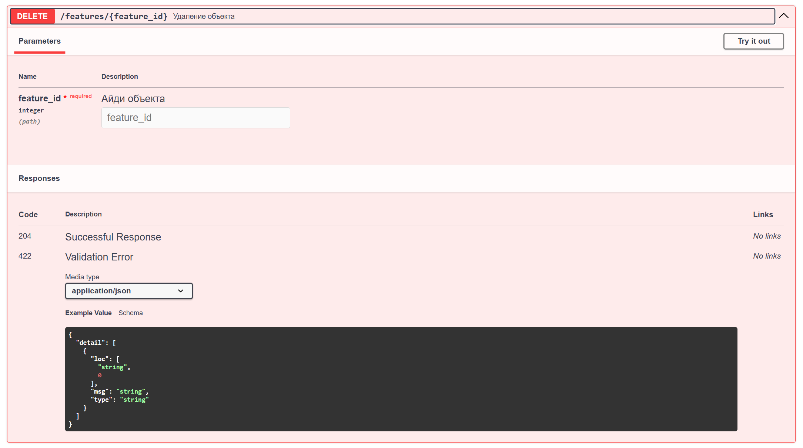

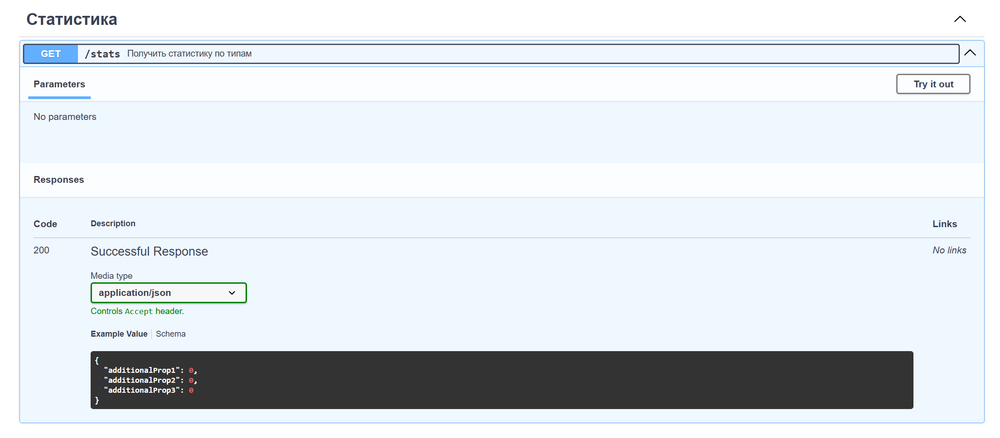
***
## Установка плагина и работа в QGIS
 - Устанавливаем плагин
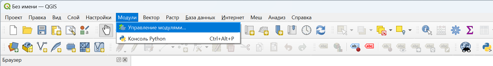
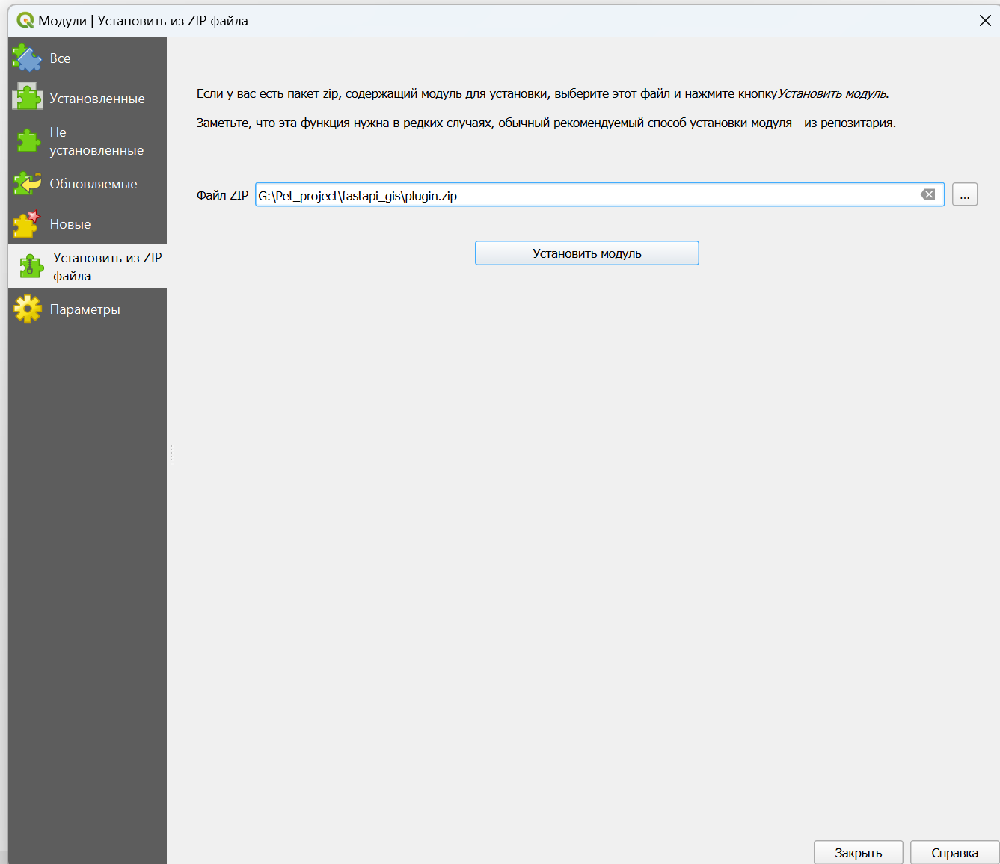
 - После установки появиться новая иконка
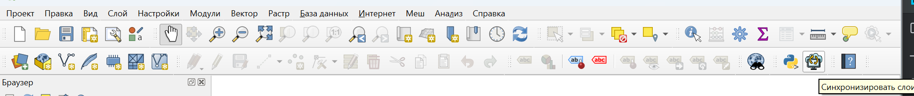
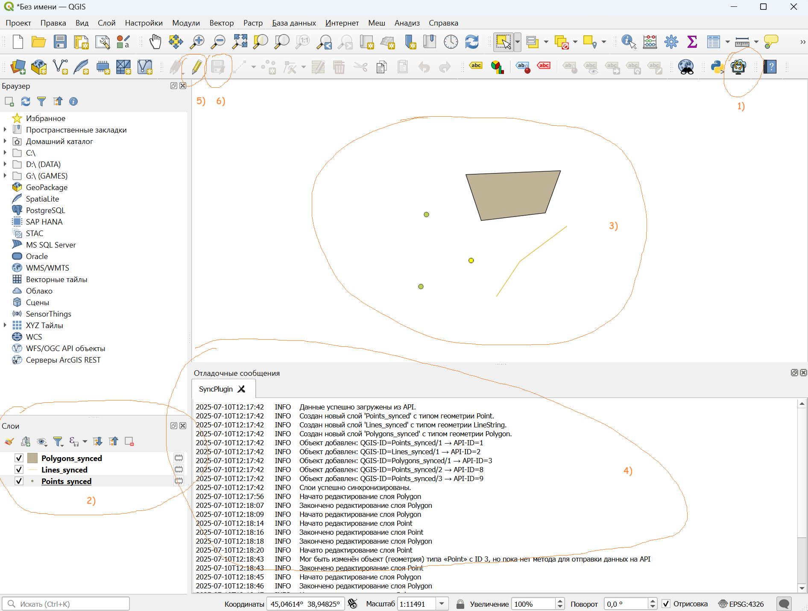
1) Загрузка объектов: При первом нажатии на иконку в пустом проекте данные объектов загрузятся из API.
2) Создание слоёв: Система автоматически создаст три слоя для работы.
3) Размещение объектов: Загруженные объекты появятся здесь.
4) Логи действий: В этом разделе отображаются все события и действия плагина.
5) Редактирование объектов:
- Чтобы добавить новый или удалить существующий объект, сначала нужно войти в режим редактирования слоя.
- Важно! Каждый тип объекта можно редактировать только в соответствующем слое.
6) Сохранение изменений:
- После добавления или удаления объектов нажмите "Сохранить слой", чтобы отправить изменения в API.
- Только после этого данные обновятся в бэкенде.
***
## Технологии:
- Бэкенд: FastAPI, SQLAlchemy, Alembic
- БД: PostgreSQL + PostGIS
- Плагин: PyQGIS API (QGIS 3.40+)

# Тестовое задание Python/GIS

## Часть 1: Бэкенд-сервис для хранения геометрий
### Задача: Написать веб-сервис на FastAPI, который будет служить хранилищем для геометрических объектов.
### Требования:
- База данных:
  - Вы можете использовать SQLite для простоты. Храните геометрию в текстовом поле в формате WKT (Well-Known Text) или как GeoJSON.
  - Если вы хотите продемонстрировать более глубокие знания, использование PostgreSQL с расширением PostGIS будет огромным плюсом.
- API эндпоинты:
  - Добавление объекта: POST /features
  - Принимает в теле запроса геометрию (в формате GeoJSON) и ее тип (Point, LineString, Polygon).
  - Сохраняет объект в БД и возвращает его уникальный ID.
  - Получение всех объектов: GET /features
  - Возвращает список всех объектов из БД в формате GeoJSON Feature Collection.
  - Удаление объекта: DELETE /features/{feature_id}
  - Удаляет объект из БД по его ID.
  - Получение статистики: GET /stats
  - Возвращает JSON с количеством объектов каждого типа, например: {"points": 15, "lines": 5, "polygons": 2}.
### Админка / Дашборд (опционально, но приветствуется):
  - Создайте простую веб-страницу, где можно посмотреть текущую статистику и, возможно, список последних добавленных объектов. Это можно сделать с помощью Jinja2 или любой другой удобной вам библиотеки.

## Часть 2: Плагин для QGIS
### Задача: Написать простой плагин для QGIS, который будет синхронизировать данные с вашим бэкенд-сервисом.
### Требования:
 - Интерфейс плагина:
  - Добавьте на панель инструментов QGIS кнопку для вашего плагина. При нажатии на нее происходит подключение/синхронизация с бэкендом.
### Работа со слоями:
  - Плагин должен работать с тремя векторными слоями: Points_synced, Lines_synced, Polygons_synced.
  - При первом запуске плагин должен проверять наличие этих слоев в проекте и создавать их, если они отсутствуют.
### Синхронизация данных:
  - Загрузка с сервера: При нажатии на кнопку плагина, он должен делать запрос к эндпоинту GET /features, получать все объекты и добавлять их на соответствующие слои в QGIS.
  - Продумайте простой механизм, как избежать дублирования объектов при повторной синхронизации (например, можно очищать слои перед загрузкой или сверять объекты по ID).
  - Отправка на сервер: Когда пользователь рисует и сохраняет новый объект на одном из этих трех слоев, плагин должен автоматически отправлять данные этого объекта на бэкенд через эндпоинт POST /features.
  - Удаление на сервере: Когда пользователь удаляет объект с одного из этих слоев, плагин должен отправлять запрос на DELETE /features/{feature_id} для удаления соответствующего объекта в БД.
